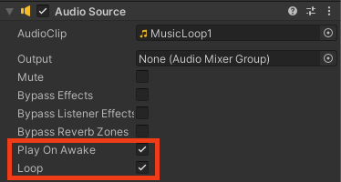

Background music can be attached to any GameObject, you could choose the floor plane, or the Player. 

Select a GameObject, in the Inspector choose 'Add Component' and then 'Audio Source'. Click on the circle next to AudioClip and choose your music. 

Make sure 'Play on Awake' is selected to automatically play the music and check the 'Loop' box to play the music repeatedly in a loop.

