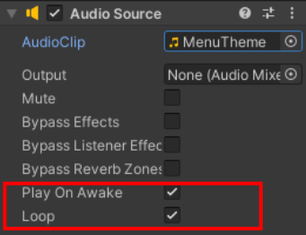

Klik op de '+' bovenaan het Hierarchy venster en kies 'Audio' en vervolgens 'Audio Source'. Klik in de Inspector op de cirkel naast AudioClip en kies je muziek.

Zorg ervoor dat 'Play on Awake' is geselecteerd om de muziek automatisch af te spelen en vink het vakje 'Loop' aan om de muziek herhaaldelijk in een lus af te spelen.

Je kunt ook het volume aanpassen.

